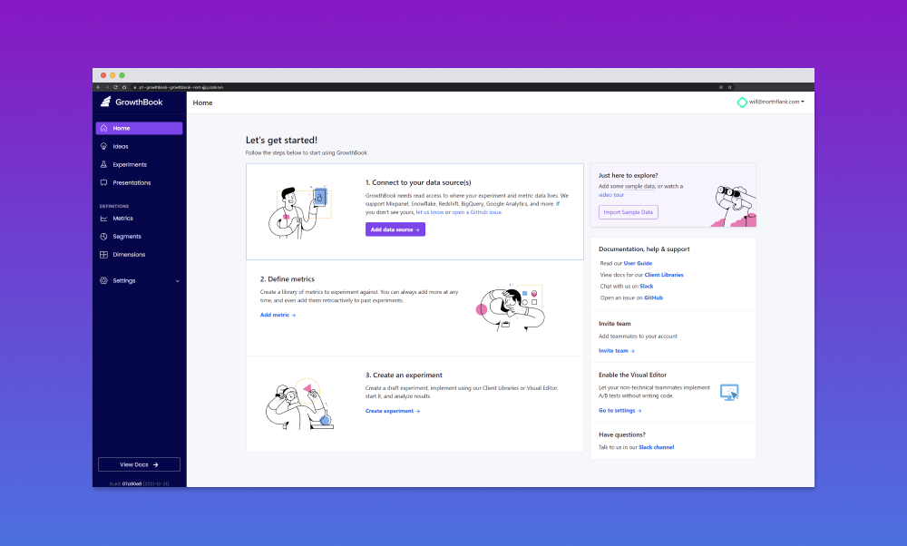

## Deploying Growthbook on Northflank



Below is a setup on Northflank costing ~ $12 a month.

To run the script you need a [Northflank API token](https://northflank.com/docs/v1/application/secure/manage-api-tokens) set as an environment variable `NF_TOKEN`

#### Getting started 
``` yarn install```

```NF_TOKEN=value yarn start```

The index.js file makes a number of API requests to [Northflank](https://northflank.com) to create a project called [Growthbook](https://github.com/growthbook/growthbook
). It creates all the required infrastructure, databases and secrets/connection strings.
The steps below can also be followed in the UI.

#### Growthbook consists of:
- 1 MongoDB Database
- 1 Web service running UI on port 3000 and API on 3100
- 1 optional Minio for self-hosted S3

#### On Northflank I can configure:

- A project in US Central, or for Europe West - override environment with `NF_REGION=europe-west`
- 1 addon
    - MongoDB on Northflank ($2/pm)
- 1 deployment service
    - Web: A deployment service deploying latest `growthbook/growthbook:latest` from DockerHub ($10/pm)
- 1 secret group
   - Securely store and inject environment variables with your `APP_ORIGIN`, `API_HOST`, `JWT_SECRET`, `ENCRYPTION_KEY` and MongoDB `MONGODB_URI` connection strings automatically
   - Use https://p1--next-js-secret-gen--gtm-deploy--nort-xjjq.code.run/secrets/64 to generate `JWT_SECRET` and `ENCRYPTION_KEY`.
